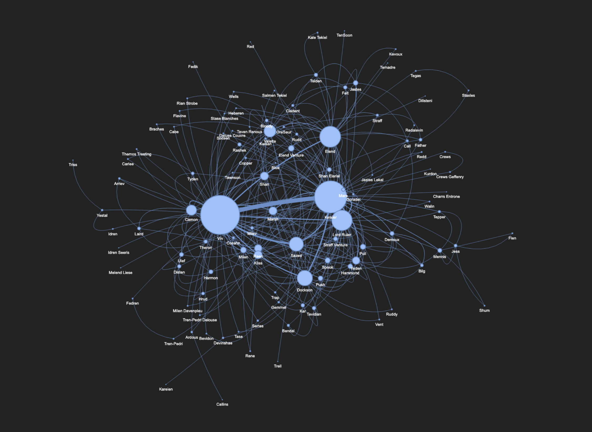
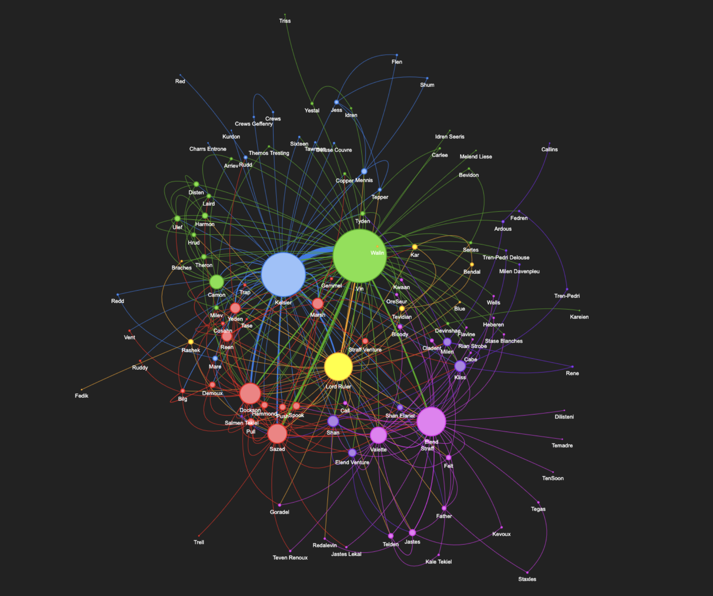
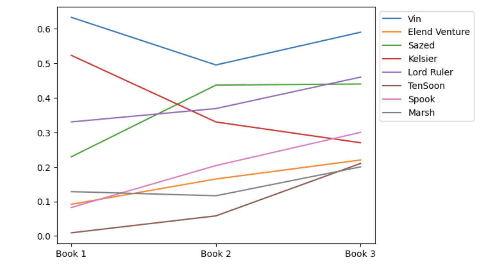

# Mistborn Character Network Analysis

This project analyzes character relationships and networks in Brandon Sanderson's Mistborn series using network analysis and visualization techniques.

## Interactive Dashboard

Explore the character relationships and communities through our interactive Streamlit dashboard:

[](https://mistborn-network.streamlit.app/)

The dashboard features:
- Interactive character relationship network
- Community detection analysis
- Character importance metrics
- Zoom, pan, and selection capabilities

## Deployment

### Streamlit Cloud Deployment

1. Push your code to GitHub
2. Go to [Streamlit Cloud](https://streamlit.io/cloud)
3. Sign in with your GitHub account
4. Click "New app"
5. Select your repository and branch
6. Set the main file path to `app.py`
7. Click "Deploy"

Your app will be available at: `https://[your-username]-mistborn-network.streamlit.app`

### Local Development

1. Clone the repository:
```bash
git clone https://github.com/yourusername/Mistborn-Book-Project.git
cd Mistborn-Book-Project
```

2. Install dependencies:
```bash
pip install -r requirements.txt
```

3. Run the Streamlit app locally:
```bash
streamlit run app.py
```

## Visualizations

### Character Relationship Network


### Community Analysis


### Character Relevance


## Project Structure

- `app.py`: Streamlit application for interactive visualization
- `mistborn.html`: Interactive character network visualization
- `mistborn_communities.html`: Interactive community analysis visualization
- `Relationship.ipynb`: Jupyter notebook containing the analysis code
- `Characters.txt`: Character data and relationships
- `pictures/`: Directory containing static visualizations

## Tools Used

- Python
- Jupyter Lab
- NetworkX for network analysis
- Pyvis for interactive network visualization
- Streamlit for web interface
- Pandas for data manipulation
- Matplotlib for static visualizations

## Features

- Interactive network visualization of character relationships
- Community detection analysis
- Character importance metrics
- Responsive web interface
- Detailed character information on selection

## Contributing

Contributions are welcome! Please feel free to submit a Pull Request.

## License

This project is licensed under the MIT License - see the LICENSE file for details.